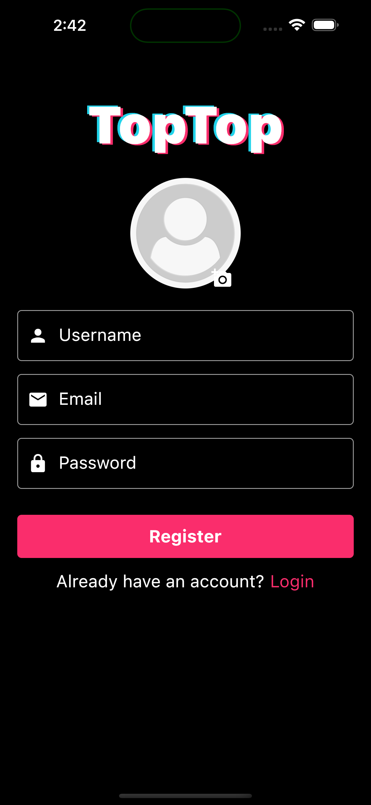
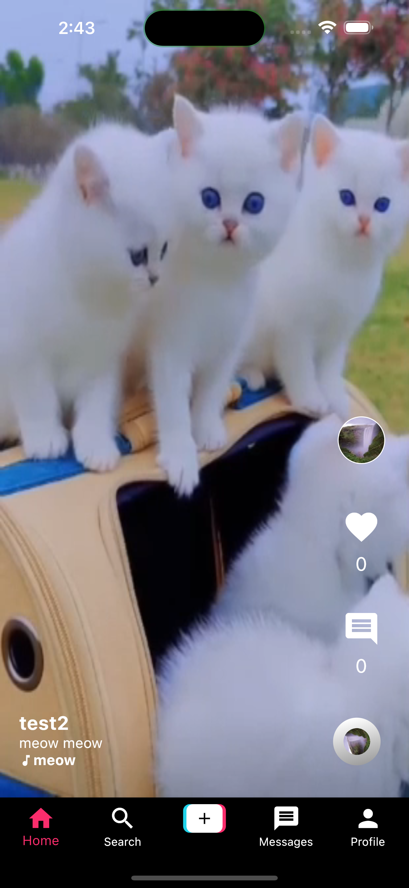
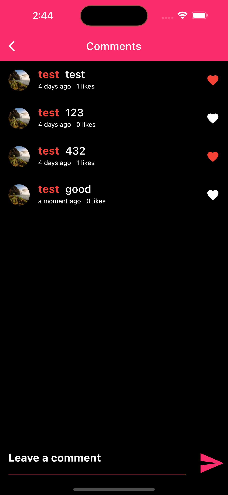
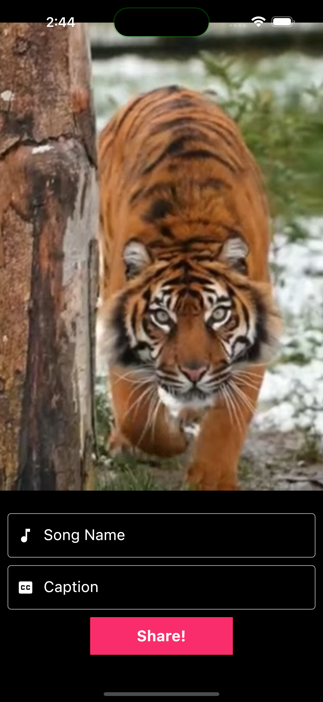
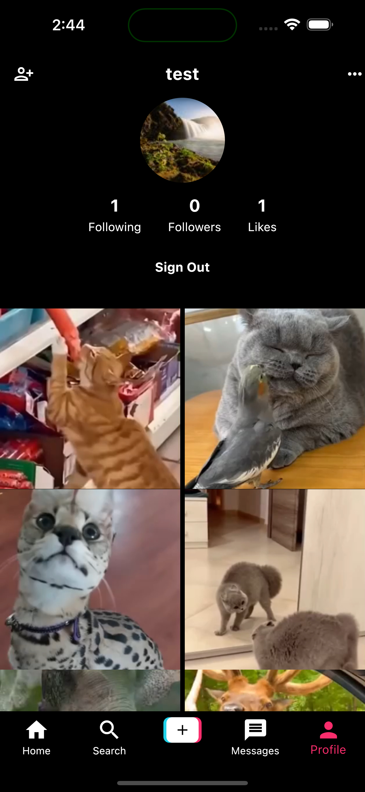

# [Giangbb Studio]

# TopTop

The ultimate TikTok clone app that brings the world of short-form video content to your fingertips. With TopTop, you can create, discover, and share captivating videos in seconds.

  
  
  
  
  

#

## Features

- Authentication with Email & Password
- Uploading Videos with Caption
- Compressing Videos
- Generating Thumbnails Out of Video
- Displaying Videos with Caption
- Liking on Posts
- Commenting on Posts
- Liking the Comments
- Searching Users
- Following Users
- Displaying Followers, Following, Likes & Posts of User
- TikTok Like UI
